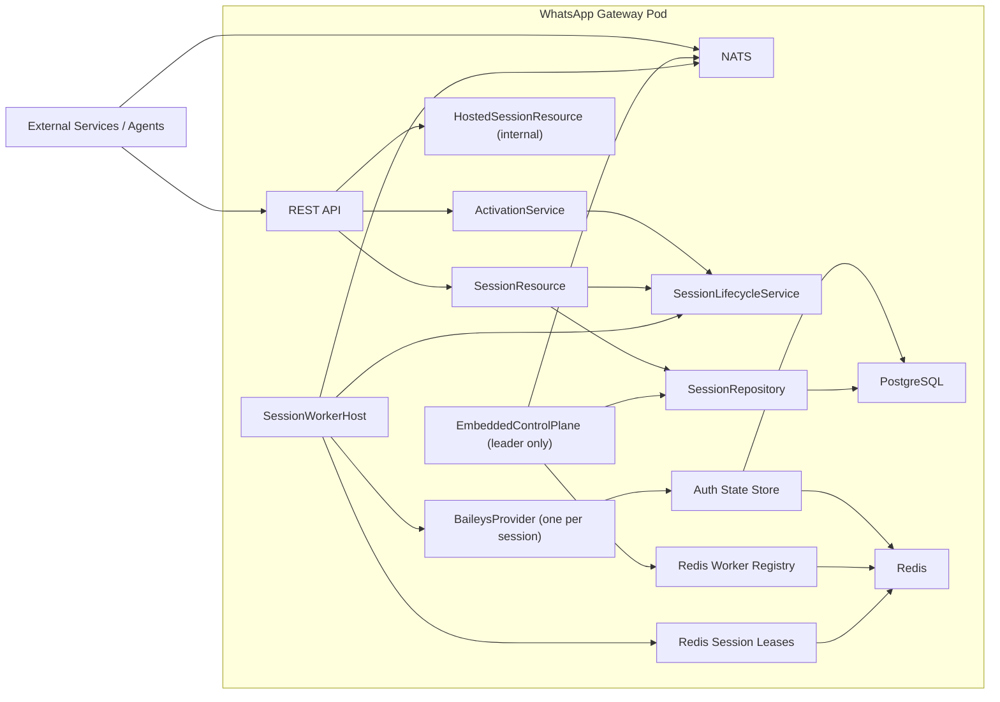
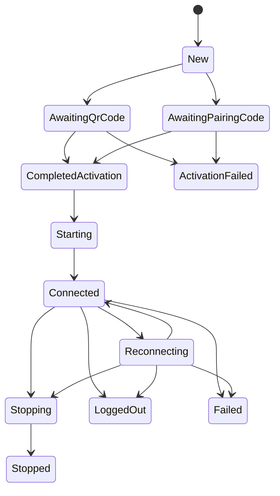
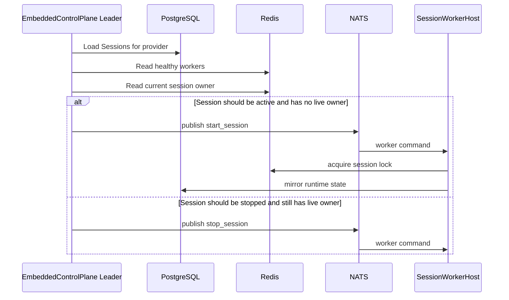
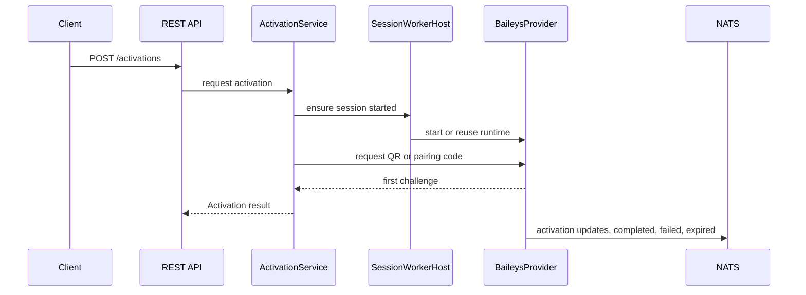

# WhatsApp Gateway

This repository implements a WhatsApp gateway microservice built on top of a custom Baileys runtime.

It is not a generic channel platform and it does not try to abstract Baileys away. The product is WhatsApp-specific by design. What this project does provide is a gateway-owned operational model around that runtime:

- durable `Session` catalog in PostgreSQL
- technical auth-state persistence in PostgreSQL + Redis
- distributed single-owner execution through Redis leases
- embedded control plane for reconciliation and worker placement
- NATS-based asynchronous integration surface
- REST surface for synchronous activation and session control

## Repository Layout

- [runtime](/Volumes/Files/Development/workspaces/digows/whatsapp-gateway/runtime)
  The production microservice.
- [sdks/java](/Volumes/Files/Development/workspaces/digows/whatsapp-gateway/sdks/java)
  Public Java integration SDK with the gateway entities, events and REST request models.

## Current Architecture

The current binary is a **self-managed gateway**.

Each pod runs the same process with three responsibilities:

1. **HTTP API**
   - synchronous operational requests
   - activation
   - durable session control

2. **Session Worker**
   - hosts live WhatsApp sessions
   - owns Baileys sockets
   - emits inbound, delivery, status and activation events

3. **Embedded Control Plane Participant**
   - all pods participate
   - only one leader reconciles the durable `Session` catalog
   - leader assigns or stops sessions across workers using NATS worker commands

### High-Level Diagram



## Domain Model

### Session vs. Authentication State

The project now distinguishes clearly between:

- **`Session`**
  - durable operational mirror of a WhatsApp session
  - owned by the gateway domain
  - used by the embedded control plane

- **`authorization_keys`**
  - technical Baileys authentication state
  - credentials, sender keys, app-state sync keys and related records
  - required for reconnecting a real WhatsApp session

The relationship is:

- one `Session` owns many authentication records
- a `Session` may exist before authentication completes
- `hasPersistedCredentials` is the operational summary of whether reconnect is possible

### Session Lifecycle



## Runtime Components

### `SessionWorkerHost`

The worker host is the runtime orchestrator inside one pod.

Responsibilities:

- subscribes to worker commands from NATS
- acquires and extends session ownership leases in Redis
- starts and stops `BaileysProvider` instances
- publishes inbound, delivery, activation and status events
- mirrors runtime transitions into the durable `Session` catalog

### `BaileysProvider`

One provider instance represents one live WhatsApp session.

Responsibilities:

- owns the Baileys socket
- handles connection lifecycle
- normalizes inbound WhatsApp messages into gateway domain entities
- performs outbound sends
- runs anti-ban behavior inside the runtime
- persists and clears auth-state through the auth store

### `EmbeddedControlPlane`

This is the leader-only reconciler running inside the same codebase.

Responsibilities:

- elect a leader through Redis
- read durable `Session` records from PostgreSQL
- read healthy worker capacity from Redis
- inspect live ownership through Redis session assignment
- publish `start_session` and `stop_session` commands to workers via NATS

This is what allows session recovery after rollout or pod failure without a second control-plane service.

## Distributed Execution Model

### Session Ownership

Only one worker may own a live WhatsApp session at a time.

That is enforced with Redis-backed leases:

- acquire lock before starting a session
- extend lock while the session is healthy
- release lock on stop or failure

If a pod dies, the lock expires and the control plane can reassign the session.

### Reconciliation Loop



## Integration Surfaces

### Public REST API

These routes are intended for infrastructure and other services:

- `GET /healthz`
- `GET /readyz`
- `POST /api/v1/workspaces/:workspaceId/activations`
- `GET /api/v1/workspaces/:workspaceId/sessions`
- `GET /api/v1/workspaces/:workspaceId/sessions/:sessionId`
- `PATCH /api/v1/workspaces/:workspaceId/sessions/:sessionId`
- `DELETE /api/v1/workspaces/:workspaceId/sessions/:sessionId`

## Java SDK

The repository now includes a Java SDK in [sdks/java](/Volumes/Files/Development/workspaces/digows/whatsapp-gateway/sdks/java).

It mirrors the public integration contract:

- `Session`, `SessionReference`, session state enums
- `Activation`, `ActivationEvent`
- `Message`, `MessageContent`, `InboundEvent`, `DeliveryResult`
- `OutboundCommand`, `OutboundCommandResult`
- outbound command families for message, presence, read, chat, group, community, newsletter, profile, privacy and call
- public REST request models for activation and session desired-state changes

Session-observed message lifecycle is exposed as:

- `message.created`
- `message.updated`
- `message.deleted`

Reaction add/change/remove is modeled as `message.updated` with
`MessageUpdateKind.Reaction`, not as a fourth event category.

`message.created` may be remote or local to the account. Use `fromMe` to distinguish
direction. For update and delete lifecycle events, `targetMessage` points to the logical
WhatsApp message being affected. When `message.updated` carries a nested `Message`, its
timestamp comes from the WhatsApp/Baileys `messageTimestamp` on the update payload.

### Distribution

There are now two supported consumption paths for the Java SDK:

- **JitPack**
  - best for public consumers that do not want Maven credentials
  - builds the SDK directly from this public repository
- **GitHub Packages**
  - published by this repository CI on pushes to `main`
  - better for internal controlled consumption

### Public Consumption with JitPack

Add the JitPack Maven repository:

```xml
<repositories>
  <repository>
    <id>jitpack.io</id>
    <url>https://jitpack.io</url>
  </repository>
</repositories>
```

Add the dependency. For JitPack, the version is the Git tag or commit hash. Example:

```xml
<dependency>
  <groupId>com.github.digows</groupId>
  <artifactId>whatsapp-gateway</artifactId>
  <version>3.0.1</version>
</dependency>
```

JitPack exposes the SDK with repository-based coordinates. The Java package base inside the jar still remains `com.digows.whatsappgateway`.

The repository root now includes [jitpack.yml](/Volumes/Files/Development/workspaces/digows/whatsapp-gateway/jitpack.yml) so JitPack builds the SDK from [/sdks/java](/Volumes/Files/Development/workspaces/digows/whatsapp-gateway/sdks/java) instead of trying to build the runtime.

### GitHub Packages Consumption

Add the dependency:

```xml
<dependency>
  <groupId>com.digows.whatsappgateway</groupId>
  <artifactId>java-whatsappgateway-sdk</artifactId>
  <version>0.1.0-SNAPSHOT</version>
</dependency>
```

Add the GitHub Packages Maven repository:

```xml
<repositories>
  <repository>
    <id>github</id>
    <url>https://maven.pkg.github.com/digows/whatsapp-gateway</url>
  </repository>
</repositories>
```

GitHub Packages Maven consumption requires credentials. Configure Maven `settings.xml` with the same repository id:

```xml
<settings>
  <servers>
    <server>
      <id>github</id>
      <username>YOUR_GITHUB_USERNAME</username>
      <password>YOUR_GITHUB_CLASSIC_PAT_WITH_READ_PACKAGES</password>
    </server>
  </servers>
</settings>
```

The Java SDK CI publishes the package there on every push to `main`.

Important semantics:

- session routes operate on the **durable session catalog**
- they are no longer limited to the local pod view
- `DELETE` means `desiredState=stopped`
- `PATCH` is the correct way to drive `desiredState`

### Internal REST API

These routes are diagnostic and local to one pod:

- `GET /internal/v1/workspaces/:workspaceId/hosted-sessions`
- `GET /internal/v1/workspaces/:workspaceId/hosted-sessions/:sessionId`

These return the in-memory hosted runtime view from the current worker only.

### NATS

The gateway remains NATS-first for asynchronous integration.

Logical subjects:

- worker control
- incoming messages
- command subjects
- command results
- delivery results
- session status
- activation lifecycle

Subject templates are environment-driven and rendered from:

- `NATS_SUBJECT_CONTROL_TEMPLATE`
- `NATS_SUBJECT_INBOUND_TEMPLATE`
- `NATS_SUBJECT_COMMAND_TEMPLATE`
- `NATS_SUBJECT_COMMAND_RESULT_TEMPLATE`
- `NATS_SUBJECT_DELIVERY_TEMPLATE`
- `NATS_SUBJECT_STATUS_TEMPLATE`
- `NATS_SUBJECT_ACTIVATION_TEMPLATE`

The default templates produce subjects such as:

- `gateway.v1.channel.whatsapp-web.worker.{workerId}.control`
- `gateway.v1.channel.whatsapp-web.session.{workspaceId}.{sessionId}.incoming`
- `gateway.v1.channel.whatsapp-web.session.{workspaceId}.{sessionId}.commands.{family}`
- `gateway.v1.channel.whatsapp-web.session.{workspaceId}.{sessionId}.command-results.{family}`
- `gateway.v1.channel.whatsapp-web.session.{workspaceId}.{sessionId}.delivery`

When `NATS_MODE=jetstream`, worker control and outbound processing use durable consumers and dedupe-aware execution.

### Outbound Commands

The outbound NATS contract is now organized by command family subjects.

Supported families today:

- `message`
  - `send`
- `presence`
  - `subscribe`
  - `update`
- `read`
  - `read_messages`
  - `send_receipt`
- `chat`
  - `archive`, `unarchive`, `pin`, `unpin`, `mute`, `unmute`
  - `clear`, `delete_for_me`, `delete_chat`
  - `mark_read`, `mark_unread`
  - `star`, `unstar`
- `group`
  - metadata, creation, invite, participant and settings operations
- `community`
  - metadata, link, invite, participant and settings operations
- `newsletter`
  - creation, metadata, follow, mute, fetch, reaction and ownership operations
- `profile`
  - profile picture, profile status, profile name, blocklist and business profile operations
- `privacy`
  - privacy fetch and privacy update operations
- `call`
  - reject and create link

Important contract semantics:

- commands must be published to `commands.{family}`
- generic execution results are published to `command-results.{family}`
- there is no compatibility rail for the old shared `outgoing` subject
- `message/send` also continues to emit the legacy delivery lifecycle on the `delivery` subject

## Activation Model

Activation is now **synchronous to request** and **asynchronous to observe**.

That means:

- the initial QR code or pairing code is requested through REST
- the response already returns the first QR code or pairing code
- subsequent updates still fan out through activation events on NATS

### Activation Flow



## Persistence

### PostgreSQL

PostgreSQL stores:

- `sessions`
  - durable operational catalog
- `authorization_keys`
  - technical auth-state storage

`authorization_keys` uses RLS by `workspace_id`.

The `sessions` table is intentionally the operational source of truth for the embedded control plane.

### Redis

Redis stores:

- session locks
- session-to-worker assignment registry
- worker heartbeat and liveness
- auth-state cache
- anti-ban warm-up state
- command dedupe markers
- control-plane leader key

## Anti-Ban Strategy

The anti-ban logic remains inside the session runtime.

It includes:

- pacing and jitter
- presence simulation
- throughput throttling
- warm-up policy
- risk monitoring
- duplicate content variation

This is an intentional design decision. The send path should not be split into an external wrapper plus an internal runtime, because that would hide real operational state from the provider that actually owns the WhatsApp socket.

See [ANTIBAN.md](./ANTIBAN.md) for more detail.

## Current Operating Modes

The current codebase supports these effective modes:

1. **Single pod**
   - worker, API and control plane all in one process

2. **Multi pod**
   - all pods run the same binary
   - one pod becomes control-plane leader
   - all pods may host sessions

The recommended production mode today is **multi pod with embedded control plane enabled**.

## Known Boundaries

What is already strong:

- durable session catalog
- distributed single-owner runtime
- embedded recovery and reassignment
- synchronous activation API
- global session control API
- internal local diagnostics API

What still remains outside the current scope:

- full authorization layer for external callers
- media download and durable media handles
- DLQ and replay tooling for operator workflows
- richer read models for analytics and audit
- ownership-aware synchronous routing for future live session actions beyond activation and desired-state changes

## Repository Entrypoints

- `src/index.ts`
  - production entrypoint
  - starts HTTP API, worker host and embedded control plane

- `src/dev.ts`
  - development entrypoint
  - starts the same runtime shape with one explicit local dev session

## Environment

See [.env.example](./.env.example).

The most important variables are:

- `CHANNEL_PROVIDER_ID`
- `POSTGRES_URL`
- `REDIS_URL`
- `NATS_URL`
- `NATS_MODE`
- `HTTP_HOST`
- `HTTP_PORT`
- `MAX_CONCURRENT_SESSIONS`
- `CONTROL_PLANE_ENABLED`
- `CONTROL_PLANE_RECONCILE_INTERVAL_MS`
- `CONTROL_PLANE_LEADER_TTL_MS`

## Integration Guide

For deployment and integration guidance aimed at another service, another coding session, or another agent, see [INTEGRATION_GUIDE.md](./INTEGRATION_GUIDE.md).
