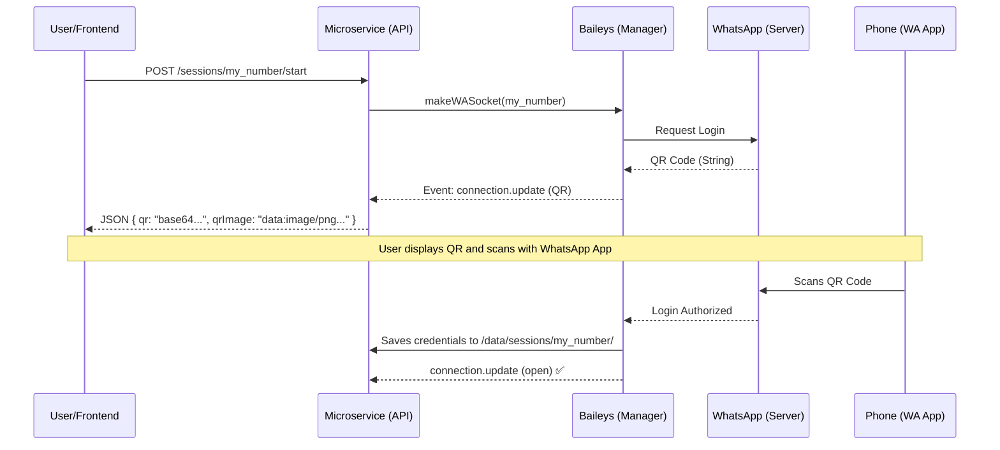
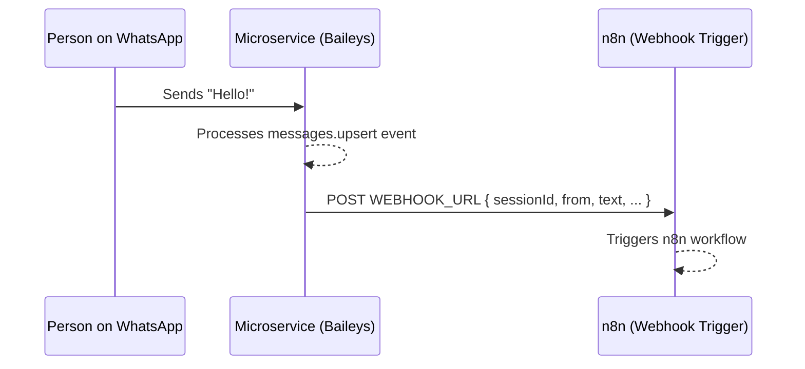
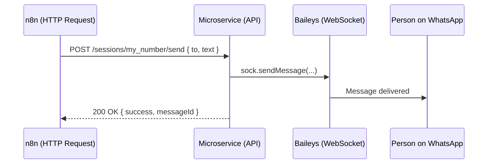

# WhatsApp Gateway

Multi-session WhatsApp microservice built with [Baileys](https://github.com/WhiskeySockets/Baileys) and [Fastify](https://fastify.dev). Connect **multiple phone numbers** simultaneously, send and receive messages via REST API, and dispatch webhooks for integration with tools like [n8n](https://n8n.io).

## Concepts

| Concept | Definition |
|---------|------------|
| **Session** | An authenticated **phone number / device**. Each session represents a phone paired via QR Code. It is **not** a conversation. |
| **Webhook** | When a message arrives on WhatsApp, the microservice sends a `POST` to a configured URL (e.g. n8n Webhook Trigger). |
| **REST API** | HTTP interface to control sessions and send messages. n8n (or any client) consumes this API. |

## Architecture

```
┌─────────────────────────────────────────────────────────┐
│                   WhatsApp Gateway                      │
│                                                         │
│  ┌─────────┐    ┌──────────────────┐    ┌───────────┐  │
│  │ Fastify  │───▶│  Session Manager │───▶│  Baileys  │──┼──▶ WhatsApp
│  │  (API)   │    │  (Multi-session) │    │ (WSocket) │  │
│  └─────────┘    └──────────────────┘    └───────────┘  │
│                          │                              │
│                  ┌───────┴────────┐                     │
│                  │    Webhook     │                     │
│                  │  Dispatcher    │────────────────────────▶ n8n
│                  └───────────────┘                     │
│                          │                              │
│                  ┌───────┴────────┐                     │
│                  │  /data/sessions │  (Persistence)     │
│                  └────────────────┘                     │
└─────────────────────────────────────────────────────────┘
```

## Operational Flows

### 1. Setup – Adding a new device



> After pairing, the session persists on disk. Restarting the microservice **does not** require a new QR Code.

### 2. Receiving Messages (WhatsApp → Gateway → n8n)



### 3. Sending Messages (n8n → Gateway → WhatsApp)



## API Endpoints

| Method   | Route                   | Description                                      |
|----------|-------------------------|--------------------------------------------------|
| `GET`    | `/health`               | Health check                                     |
| `GET`    | `/sessions`             | List all active sessions and their status        |
| `POST`   | `/sessions/:id/start`   | Start session; returns QR Code if not authenticated |
| `GET`    | `/sessions/:id/status`  | Session status (`open`, `qr`, `close`, `connecting`) |
| `GET`    | `/sessions/:id/qr`      | QR Code as PNG image (open in browser to scan)   |
| `POST`   | `/sessions/:id/send`    | Send text or image message                       |
| `DELETE` | `/sessions/:id`         | Logout and remove session                        |

### Usage Examples

**Start a session:**
```bash
curl -X POST http://localhost:3000/sessions/support/start
# Returns: { "id": "support", "status": "qr", "qr": "...", "qrImage": "data:image/png;base64,..." }
```

**Scan QR in browser:**
```
http://localhost:3000/sessions/support/qr
```

**Send a text message:**
```bash
curl -X POST http://localhost:3000/sessions/support/send \
  -H "Content-Type: application/json" \
  -d '{"to": "5511999999999", "text": "Hello from n8n!"}'
```

**Send an image with caption:**
```bash
curl -X POST http://localhost:3000/sessions/support/send \
  -H "Content-Type: application/json" \
  -d '{"to": "5511999999999", "image": {"url": "https://example.com/photo.jpg", "caption": "Check this out!"}}'
```

**Webhook payload received by n8n:**
```json
{
  "sessionId": "support",
  "event": "messages.upsert",
  "data": {
    "from": "5511888888888@s.whatsapp.net",
    "pushName": "John Doe",
    "messageId": "ABC123",
    "text": "I need help!",
    "hasMedia": false,
    "timestamp": 1709510400
  }
}
```

## Environment Variables

| Variable       | Default             | Description                              |
|----------------|---------------------|------------------------------------------|
| `PORT`         | `3000`              | HTTP API port                            |
| `HOST`         | `0.0.0.0`           | Bind host                                |
| `DATA_DIR`     | `./data/sessions`   | Session persistence directory            |
| `WEBHOOK_URL`  | *(empty)*           | n8n Webhook Trigger URL for incoming messages |
| `WEBHOOK_STATUS_URL` | *(empty)*       | Optional n8n Webhook URL for connection events (e.g. `connection.open`, `connection.logout`) |
| `WEBHOOK_USER` | *(empty)*           | Optional Basic Auth Username for Webhook |
| `WEBHOOK_PASSWORD` | *(empty)*       | Optional Basic Auth Password for Webhook |
| `LOG_LEVEL`    | `info`              | Log level (`trace`, `debug`, `info`, `warn`) |
| `NODE_ENV`     | *(empty)*           | Set to `production` to disable pretty-print |

## Getting Started

```bash
# Install dependencies
npm install

# Run in development mode (hot-reload)
WEBHOOK_URL=https://your-n8n.com/webhook/abc123 npm run dev

# Production build
npm run build
npm start
```

## Docker

```bash
# Build image
docker build -t whatsapp-gateway .

# Run container
docker run -d \
  --name whatsapp-gateway \
  -p 3000:3000 \
  -v whatsapp-data:/app/data/sessions \
  -e WEBHOOK_URL=https://your-n8n.com/webhook/abc123 \
  whatsapp-gateway
```

> The volume `-v whatsapp-data:/app/data/sessions` ensures sessions persist across container restarts.

## Tech Stack

- **Runtime:** Node.js 20
- **Framework:** Fastify
- **WhatsApp:** [@whiskeysockets/baileys](https://github.com/WhiskeySockets/Baileys)
- **Logging:** Pino
- **Language:** TypeScript
